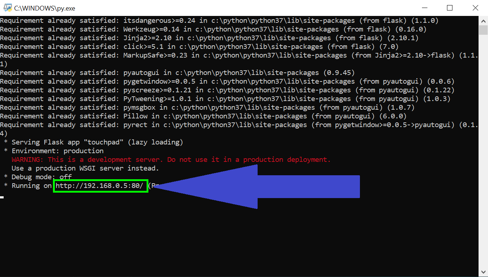

# Phone Touchpad

Control computer mouse with an Android phone.

## Getting Started

A just-for-fun project!  
I have change the code but I haven't tested it so I don't know if it really works or not, but you can give it a try. 😁  
Have fun with discovering the app! 😁  

### Prerequisites

An Android Phone  

Python  

### Installing

#### Computer

Download the repository:  

```
git clone https://github.com/datletrung/phone-touchpad.git  
cd phone-touchpad  
```

#### Phone

Install touchpad.apk  
You can modify my code:  
  - Go to http://ai2.appinventor.mit.edu/
  - Upload file touchpad.aia and start playing! 😁  

### Running the code

There are 2 files that are run.py and test.py:  
  - test.py is still a test version (I want to create a GUI that can inform us which Phone is being connected), play with it if you want.  
  - run.py runs a server and receives any phone that wants to connect to it.  

Start the server by clicking the file touchpad.py (do not open Python IDLE). You should see your computer IP in the last line.  
Start the app on your phone, enter your computer IP and tada!! 😁  



## Authors  

* **Tin Le** - **Lê Trung Tất Đạt** - (https://github.com/datletrung)  